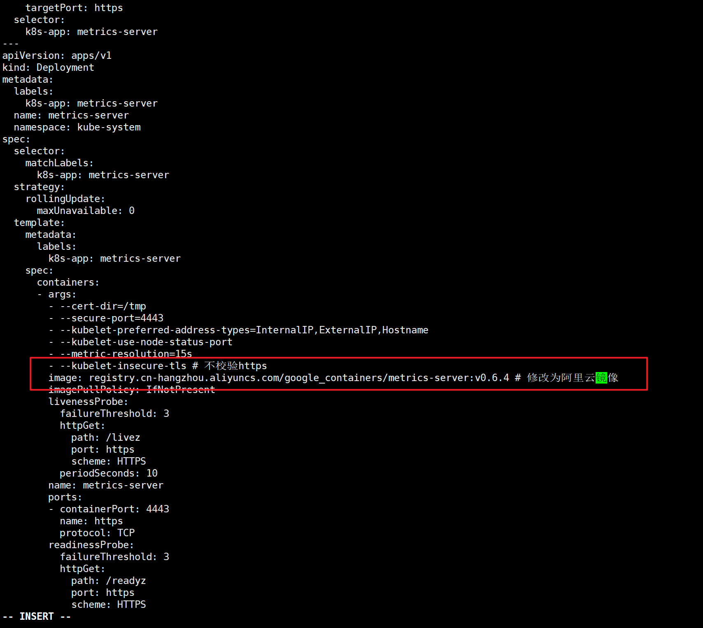
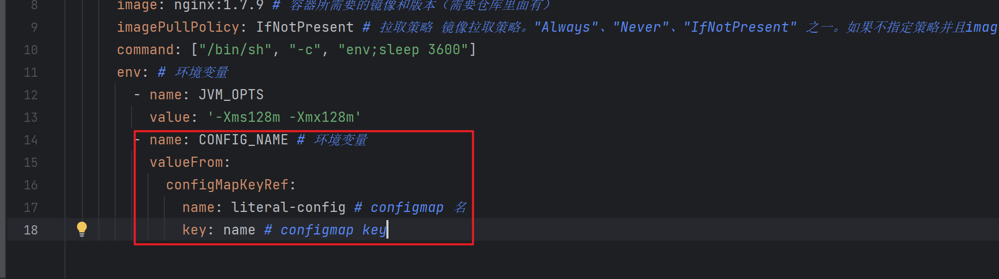
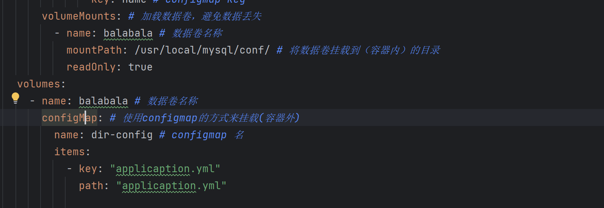
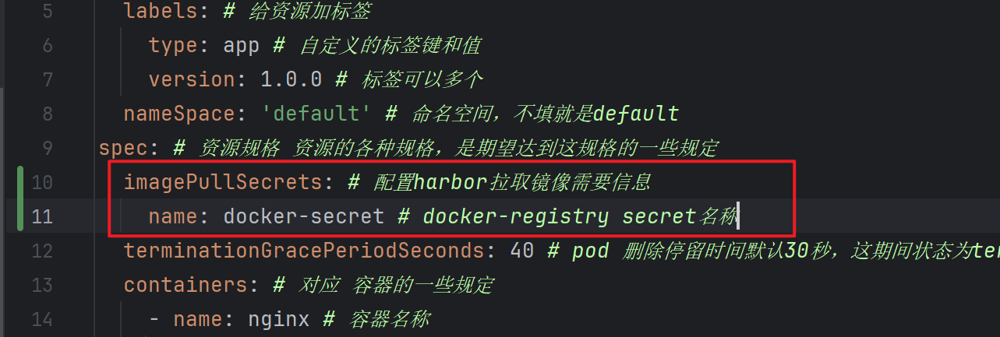
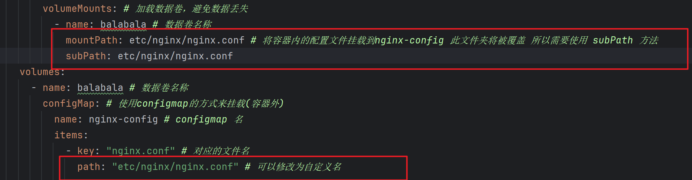
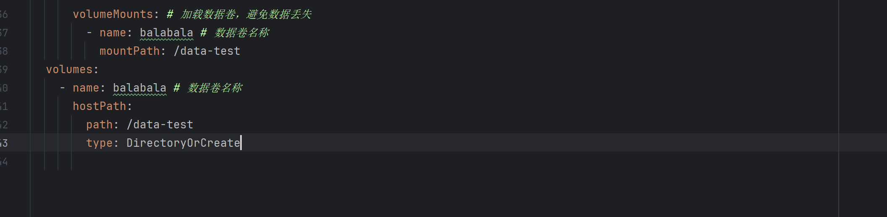

# kubectl
### 偶直接就是上地址 https://kubernetes.io/docs/reference/generated/kubectl/kubectl-commands

### 在任意节点使用kubectl操作

master节点下admin.conf记录了最高权限的用户账号，复制到其他节点后即可访问所以资源

1. 复制master下的/etc/kubernetes/admin.conf 到节点机下
> scp /etc/kubernetes/admin.conf 节点IP:/etc/kubernetes/

2配置环境变量
> echo "export KUBECONFIG=/etc/kubernetes/admin.conf" >> ~/.bash_profile  
> source ~/.bash_profile

### 查看命名空间
> kubectl get ns

### 查看默认命名空间pods
> kubectl get pods 

### 查看kube-system命名空间pods
> kubectl get pods -n kube-system

### 查看配置节点
> kubectl get nodes

### 查看pod详情
> kubectl describe pods pods全名 -n 命名空间

### 查看deploy
> kubectl get deploy

### 查看deploy输出为yaml文件
> kubectl get deploy deploy全名 -o yaml

### 修改pod副本数量

### 修改pod副本数量(扩容/缩容)
> kubectl scale deploy --replicas=3 deploy全名

### 删除delopy
> kubectl delete deploy deploy全名

### 删除servers
> kubectl delete svc svc全名

### yaml资源pod标签详解 
> https://kubernetes.io/zh-cn/docs/reference/kubernetes-api/workload-resources/pod-v1/#PodStatus

### 编辑coredns的配置文件（用编辑，实际上只是想复制里面的配置信息）
> kubectl edit deploy -n kube-system coredns

### 在pod里的容器里执行命令 cat /inited
> kubectl exec -it nginx-demo -c nginx -- cat /inited

### 实时查看pod变化
> kubectl get po -w

### 查看pod的label
> kubectl get po pod名 --show-labels -n 命名空间

### 修改pod的label（临时修改，一刷新就没）
> kubectl label po pod名 原有label键=修改值 --overwrite  -n 命名空间

### 新增pod的label（临时修改，一刷新就没）
> kubectl label po pod名 新label键=值

### 搜索pod by labels
并集
> kubectl get po -l 键=值,键=值,键=值 

一个键多个值的匹配  
> kubectl get po -l 键=值,键=值,键 in (值, 值, 值) 

### 获取ReplicaSet(RS)
> kubectl get rs

### 命令创建deployment
> kubectl create deployment nginx-deploy --image=nginx:1.7.9

### 查看deploy滚动更新状态
> kubectl rollout status deploy全名

### 修改deploy镜像
> kubectl set image deployment/资源名 nginx=nginx:1.7.9

### 查看deploy修改历史版本（可选：查看版本详情）
> kubectl rollout history deployment/资源名 [--revision=版本号]

### 暂停/恢复 

暂停
> kubectl rollout pause deployment/资源名 

恢复
> kubectl rollout resume deployment/资源名 

### 替换
> kubectl replace -f xxx.yaml

### 查看所有资源
> kubectl get all

### 启动busybox并进入sh
> kubectl -it run --image busybox busybox /bin/sh

### 进入busybox sh
> kubectl -it exec  busybox /bin/sh

### 使用patch修改镜像
> （无法使用，scale命令替换）kubectl patch sts web --type='json' -p='[{"op": "replace","path": "/spec/containers/0/image","value": "nginx:1.9.1"}]'

### 删除statefulset默认级联删除，即sts和pod一起删除，若想非级联删除添加选项 --cascade=false
> kubectl delete web sts --cascade=orphan

### 自动扩容缩容
> kubectl autoscale deploy nginx-outdoor --cpu-percent=20 --min=2 --max=5

### metrics安装
下载metrics
> https://github.com/kubernetes-sigs/metrics-server/releases/latest/download/components.yaml  

修改yaml

> \- --kubelet-insecure-tls # 加上该启动参数 (单独的-打不出了加了\就变这样)  
> image: registry.cn-hangzhou.aliyuncs.com/google_containers/metrics-server:v0.6.4

查看pod是否安装(metrics-server pod是否存在)
> kubectl get pods -n kube-system

安装好后可以查看cpu、内存使用情况
> kubectl top pods 

查看日志
> kubectl logs -f pod名

### 创建configmap的4种方式
1. 目录创建 (test目录下的所有配置文件将加载到dir-config中)
> kubectl create cm dir-config --from-file=./config/test

2. 配置文件创建(根据对应的配置文件创建file-config)
> kubectl create cm file-config --from-file=./config/app.yml

3. 配置文件改名创建（根据配置文件修改其名称创建file-alis-config)
> kubectl create cm file-alis-config --from-file=ggboy.yml=./config/app.yml

4. 命令行参数创建(name=wu, nihao=wohao)
> kubectl crate cm literal-config --from-literal=name=wu --from-literal=nihao=wohao

### configmap使用2种方式
1. 通过引用方式获取值(参考configmap.yaml)

2. 通过挂载方式获取值(参考configmap.yaml)

### secret 创建
1. 使用generic方式创建(参数同configmap一样) secret 采用base64编码
> kubectl create secret generic secret-demo --from-literal=key1=supersecret

2. 使用docker-registry方式创建 (配置本地docker仓库harbor使用)
> kubectl create secret docker-registry docker-secret --docker-username=user --docker-passw
ord=password --docker-email=email@163.com --docker-server=127.0.0.1

### subpath 挂载方式
因：当使用configmap 或 secret 文件挂载时 挂载的目录有其他文件会将其它文件全部清除只留下configmap的文件或者secret文件
使用 subpath 只覆盖对应的文件

### 配置文件不可变
因：在开发测试环境可以修改配置，但是到了生产环境就不希望配置文件变化了
所：可以在配置添加immutable: true 禁止修改
1. 编辑cm
> kubectl edit cm 配置名
2. 在最外层添加immutable: true
> immutable: true

### hostpath 容器外节点内文件挂载
直接亮剑

### pod 内容器目录共享
参考empty-dir.yaml

### nfs
nfs（网络文件系统） 实现多台节点通过网络实现文件共享
1. 安装，多台设备
> yum install -y nfs-utils

2. 启动，多台设备
> systemctl start nfs-server

3. 创建共享目录，被共享文件设备
> mkdir =p /home/nfs/ro
> mkdir -p /home/nfs/rw

4. 配置共享目录，被共享文件设备
> vi /etc/exports （添加以下内容）
/home/nfs/ro 192.168.198.0/24(ro,sync,no_subtree_check,no_root_squash)
/home/nfs/rw 192.168.198.0/24(rw,sync,no_subtree_check,no_root_squash)

5. 刷新，重启，被共享文件设备
> exportsfs -f
> systemctl reload nfs-server

6. 装载，共享文件设备
> mkdir -p /mnt/nfs/ro
> mkdir -p /mnt/nfs/rw
> mount -t nfs 192.168.198.161:/home/nfs/rw /mnt/nfs/rw
> mount -t nfs 192.168.198.161:/home/nfs/ro /mnt/nfs/ro

共享文件设备和被共享文件设备的文件夹 ro 和 rw 已共享