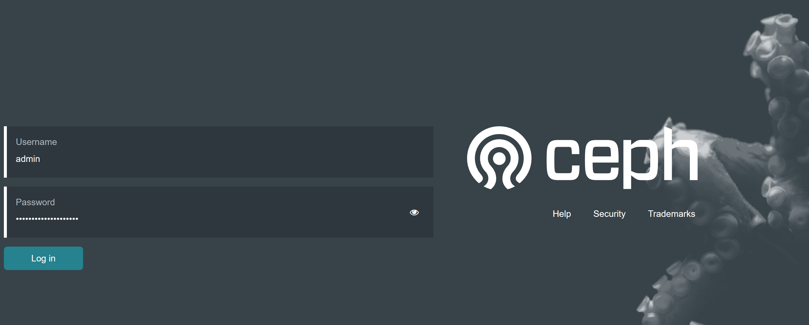
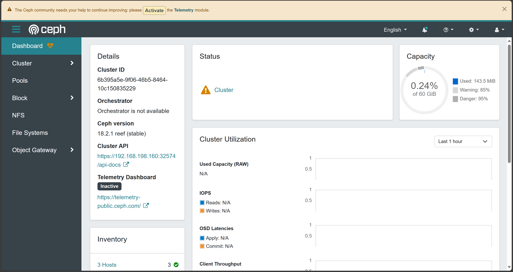

环境信息
kubernetes: v1.28.2
rook: v1.13.1

#Ceph OSD 在某些情况下(比如启用加密或指定元数据设备)依赖于 LVM(Logical Volume Manager)。如果没有安装 LVM2 软件包，则虽然 Rook 可以成功创建 Ceph OSD，但是当节点重新启动时，重新启动的节点上运行的 OSD pod 将无法启动。
> yum -y install lvm2


#数据盘可以是一块硬盘sdb,也可以是硬盘的一个分区sdb2,或者是逻辑卷，但是这些都必须没有被格式过，没有指定文件系统类型。
#可以使用lsblk -f 来确认数据盘有没有被文件系统格式化过。FSTYPE字段为空即代表未被文件系统格式化过。
#如下所示，sdb可以作为ceph的数据盘。

```shell
[root@k8s-master ~]# lsblk -f  
NAME   FSTYPE  LABEL    UUID                                 MOUNTPOINT
sr0    iso9660 config-2 2023-05-08-09-42-28-00               
sda                                                          
 ├─sda1 xfs              624b9bfb-904e-4d69-b7e0-cf598f443497 /boot
 └─sda2 xfs              974b2a82-1668-42c8-a4b6-bb1d24eada2f /
sdb   
```

```shell
#Ceph 存储需要包含了 RBD 模块的 Linux 内核来支持。在使用 Kubernetes 环境中运行 Ceph 存储之前，需要在 Kubernetes 节点上运行 modprobe rbd 命令来测试当前内核中是否已经加载了 RBD 内核。
#查看内核有没有加载rbd模块
#如下所示代表已加载
lsmod | grep rbd
[root@master ~]# lsmod | grep rbd
rbd                    83640  0 
libceph               306625  1 rbd
 
#如未加载可手动加载rbd内核模块
modprobe rbd
```
下载rook
> git clone --single-branch --branch v1.13.1 https://github.com/rook/rook.git

修改./rook/deploy/examples/operator.yaml镜像
```shell
  # The default version of CSI supported by Rook will be started. To change the version
  # of the CSI driver to something other than what is officially supported, change
  # these images to the desired release of the CSI driver.
  # ROOK_CSI_CEPH_IMAGE: "quay.io/cephcsi/cephcsi:v3.10.1"
  ROOK_CSI_REGISTRAR_IMAGE: "registry.aliyuncs.com/google_containers/csi-node-driver-registrar:v2.9.1"
  ROOK_CSI_RESIZER_IMAGE: "registry.aliyuncs.com/google_containers/csi-resizer:v1.9.2"
  ROOK_CSI_PROVISIONER_IMAGE: "registry.aliyuncs.com/google_containers/csi-provisioner:v3.6.2"
  ROOK_CSI_SNAPSHOTTER_IMAGE: "registry.aliyuncs.com/google_containers/csi-snapshotter:v6.3.2"
  ROOK_CSI_ATTACHER_IMAGE: "registry.aliyuncs.com/google_containers/csi-attacher:v4.4.2"
```

安装
> cd rook/deploy/examples  
> kubectl create -f crds.yaml -f common.yaml -f operator.yaml  
> kubectl create -f cluster.yaml

等待安装完成
> kubectl get all -n rook-ceph

```shell
[root@k8s-master ~]# kubectl get all -n rook-ceph
NAME                                                      READY   STATUS      RESTARTS        AGE
pod/csi-cephfsplugin-9j6vr                                2/2     Running     0               3h31m
pod/csi-cephfsplugin-mvwjk                                2/2     Running     0               3h31m
pod/csi-cephfsplugin-provisioner-66f988888d-5lgzd         5/5     Running     2 (12m ago)     3h31m
pod/csi-cephfsplugin-provisioner-66f988888d-7cdc6         5/5     Running     0               3h31m
pod/csi-cephfsplugin-rcl8v                                2/2     Running     0               3h28m
pod/csi-rbdplugin-n5xgr                                   2/2     Running     0               3h31m
pod/csi-rbdplugin-provisioner-57ddddd8fc-q2d2n            5/5     Running     1 (12m ago)     3h31m
pod/csi-rbdplugin-provisioner-57ddddd8fc-s9b9t            5/5     Running     0               3h31m
pod/csi-rbdplugin-st5q5                                   2/2     Running     0               3h31m
pod/csi-rbdplugin-xp6g6                                   2/2     Running     0               3h28m
pod/rook-ceph-crashcollector-k8s-master-7c4c8d9fd-dg5bf   1/1     Running     0               173m
pod/rook-ceph-crashcollector-k8s-node1-6d59c467f5-jjsxg   1/1     Running     0               173m
pod/rook-ceph-crashcollector-k8s-node2-6b5b65bb56-zn8kx   1/1     Running     0               3h26m
pod/rook-ceph-exporter-k8s-master-dc6986c9d-nlcsv         1/1     Running     0               173m
pod/rook-ceph-exporter-k8s-node1-589f6f6b67-x4k88         1/1     Running     3 (120m ago)    173m
pod/rook-ceph-exporter-k8s-node2-96b56fc84-cbplg          1/1     Running     0               3h26m
pod/rook-ceph-mgr-a-77ffbcfb59-psttn                      3/3     Running     0               3h26m
pod/rook-ceph-mgr-b-7ff54b8864-qts5d                      3/3     Running     33 (115s ago)   3h26m
pod/rook-ceph-mon-a-7d4df57bdb-ksjhx                      2/2     Running     12 (113s ago)   3h28m
pod/rook-ceph-mon-b-75f485c454-26h8s                      2/2     Running     0               3h27m
pod/rook-ceph-mon-c-58cbc44fb9-vh4cn                      2/2     Running     0               3h27m
pod/rook-ceph-operator-5d9455bdcd-tnhgg                   1/1     Running     0               3h32m
pod/rook-ceph-osd-0-7955956747-czvct                      2/2     Running     0               3h25m
pod/rook-ceph-osd-1-5486669948-w47mm                      2/2     Running     0               173m
pod/rook-ceph-osd-2-dcbd854f4-smk9h                       2/2     Running     11 (114s ago)   173m
pod/rook-ceph-osd-prepare-k8s-master-jsp7h                0/1     Completed   0               6m31s
pod/rook-ceph-osd-prepare-k8s-node1-d7dln                 0/1     Completed   0               6m28s
pod/rook-ceph-osd-prepare-k8s-node2-d9wtq                 0/1     Completed   0               6m25s
```

安装测试工具
> cd rook/deploy/examples/  
> kubectl apply -f toolbox.yaml

进入容器
> kubectl exec -it rook-ceph-tools-598b59df89-kqjr9 -n rook-ceph -- bash
```shell
# 查看ceph状态
bash-4.4$ ceph -s
  cluster:
    id:     d5215f94-1830-4e95-96b7-d2ddbd6302da
    health: HEALTH_OK
 
  services:
    mon: 3 daemons, quorum a,b,c (age 4m)
    mgr: b(active, since 2m), standbys: a
    osd: 6 osds: 6 up (since 2m), 6 in (since 3

  data:
    pools:   1 pools, 1 pgs
    objects: 2 objects, 449 KiB
    usage:   122 MiB used, 180 GiB / 180 GiB avail
    pgs:     1 active+clean
 
bash-4.4$ ceph osd tree
ID  CLASS  WEIGHT   TYPE NAME        STATUS  REWEIGHT  PRI-AFF
-1         0.17578  root default                              
-7         0.06839      host master                           
 1    hdd  0.04880          osd.1        up   1.00000  1.00000
 3    hdd  0.00980          osd.3        up   1.00000  1.00000
 5    hdd  0.00980          osd.5        up   1.00000  1.00000
-5         0.05859      host node1                            
 2    hdd  0.04880          osd.2        up   1.00000  1.00000
 4    hdd  0.00980          osd.4        up   1.00000  1.00000
-3         0.04880      host node2                            
 0    hdd  0.04880          osd.0        up   1.00000  1.00000
 
bash-4.4$ ceph osd status
ID  HOST     USED  AVAIL  WR OPS  WR DATA  RD OPS  RD DATA  STATE      
 0  node2   21.0M  49.9G      0        0       0        0   exists,up  
 1  master  19.6M  49.9G      0        0       0        0   exists,up  
 2  node1   20.9M  49.9G      0        0       0        0   exists,up  
 3  master  19.6M  9.98G      0        0       0        0   exists,up  
 4  node1   19.7M  9.98G      0        0       0        0   exists,up  
 5  master  20.8M  9.97G      0        0       0        0   exists,up  
 
bash-4.4$ ceph osd pool ls
.mgr

# 退出
bash-4.4$ exit 
```

安装dashboard
```shell
kubectl create -f dashboard-external-https.yaml
kubectl get svc -n rook-ceph
 
#删除原有的dashboard service
kubectl delete svc/rook-ceph-mgr-dashboard -n rook-ceph
 
访问地址：https://主机ip:NodePort分配端口
用户名默认是admin，密码: 如下
密码可以通过以下代码获取：
kubectl -n rook-ceph get secret rook-ceph-dashboard-password -o jsonpath="{['data']['password']}"|base64 --decode && echo
```




安装storageClass
```shell
[root@master rbd]# cd /root/rook/deploy/examples/csi/rbd
[root@master rbd]# ls
pod-ephemeral.yaml  pod.yaml  pvc-clone.yaml  pvc-restore.yaml  pvc.yaml  snapshotclass.yaml  snapshot.yaml  storageclass-ec.yaml  storageclass-test.yaml  storageclass.yaml
 
#执行rook自带的创建ceph rbd 存储类的yaml,创建存储类
[root@master rbd]# kubectl create -f storageclass.yaml 
cephblockpool.ceph.rook.io/replicapool created
storageclass.storage.k8s.io/rook-ceph-block created
#存储类创建成功
[root@master rbd]# kubectl get sc -n rook-ceph
NAME              PROVISIONER                  RECLAIMPOLICY   VOLUMEBINDINGMODE   ALLOWVOLUMEEXPANSION   AGE
rook-ceph-block   rook-ceph.rbd.csi.ceph.com   Delete          Immediate           true                   20s
 
#测试存储类是否可以直接创建pvc，不需要提前创建pv
[root@master rbd]# kubectl get pvc -A
No resources found
[root@master rbd]# kubectl get pv -A
No resources found
[root@master rbd]# kubectl create -f pvc.yaml 
persistentvolumeclaim/rbd-pvc created
 
 #可以看到pv和pvc已经创建好了，且已经自动绑定了
[root@master rbd]# kubectl get pv -A
NAME                                       CAPACITY   ACCESS MODES   RECLAIM POLICY   STATUS   CLAIM             STORAGECLASS      REASON   AGE
pvc-0760d1b6-e301-4f09-80d0-471ea705a34f   1Gi        RWO            Delete           Bound    default/rbd-pvc   rook-ceph-block            3m47s
[root@master rbd]# kubectl get pvc -A
NAMESPACE   NAME      STATUS   VOLUME                                     CAPACITY   ACCESS MODES   STORAGECLASS      AGE
default     rbd-pvc   Bound    pvc-0760d1b6-e301-4f09-80d0-471ea705a34f   1Gi        RWO            rook-ceph-block   2s
[root@master rbd]# 

```

### 两个意料之外的问题
1. 镜像拉取失败，不是operator配置好的失败而是之外的镜像失败，能拉取当时太大了，所以我直接在外面自己拉了下来
> crictl pull quay.io/cephcsi/cephcsi

2. cluster.yaml创建完之后，一直卡住，找到原因是服务器时间不同步，后来使用ntp服务器同步了，详情请看[ntplinux时间同步.md](../../Linux/ntplinux时间同步.md)
