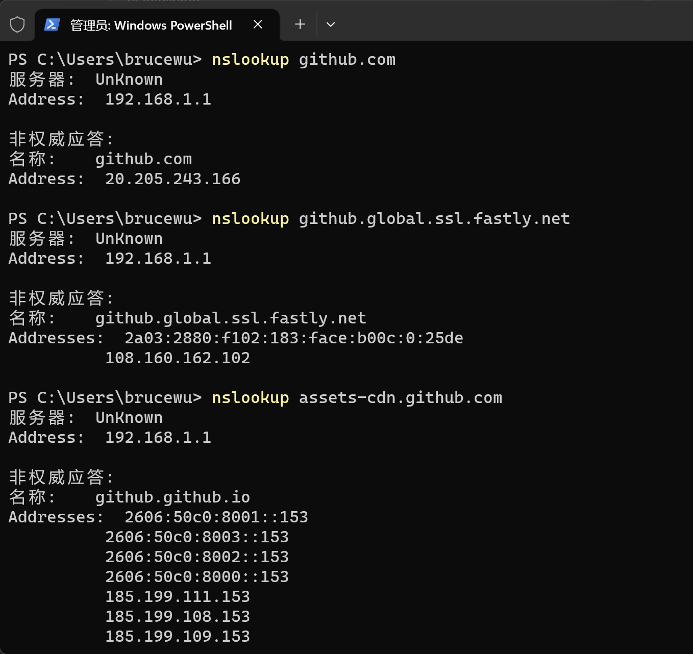
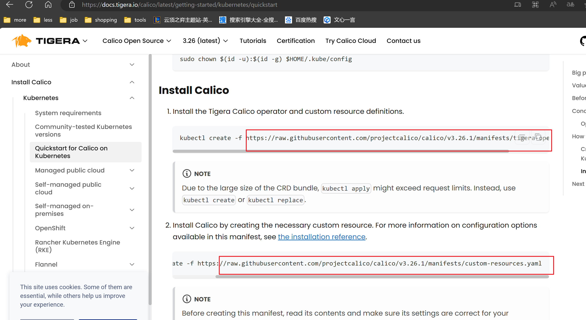
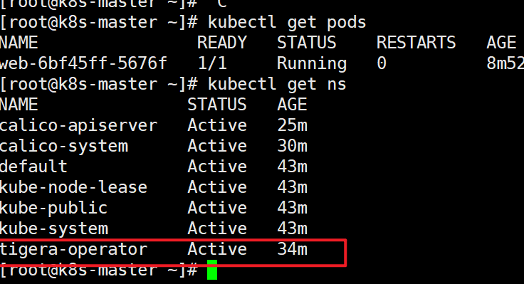

# 安装k8s 1.28.1

# 准备虚拟机 - 准备3台 centos7u9

工具：vmware 17 player(免费版)

iso：contos7u9(清华源下载)

### 设置主机名

主机名字分别为 k8s-master k8s-node1 k8s-node2

> 例如： hostnamectl set-hostname k8s-master

### 设置ip地址
编辑/etc/sysconfig/network-scripts/ifcfg-ens33文件

追加以下 

master 对应 192.168.198.160

node1 对应 192.168.198.161

node2 对应 192.168.198.162

> IPADDR="192.168.198.160"
> 
> PREFIX="24"
> 
> GATEWAY="192.168.198.2"
> 
> DNS1="119.29.29.29"

### 设置ip地址对应主机名
编辑/etc/hosts文件

> 192.168.198.160 k8s-master
> 
> 192.168.198.161 k8s-node1
> 
> 192.168.198.162 k8s-node2

### 关闭防火墙

查看防火墙状态
> firewall-cmd --state

关闭防火墙
> systemctl stop firewalld

设置关闭防火墙开机自启动
> systemctl disable firewalld

以上两条功能合并
> systemctl disable --now firewalld

### 关闭selinux
查看状态
> sestatus

设置selinux配置文件
> sed -ri 's/SELINUX=enforcing/SELINUX=disabled/' /etc/selinux/config

接重启虚拟机
> reboot

### 时间同步

安装ntpdate
> yum install -y ntpdate

查看定时任务
> crontab -l

编辑定时任务
> crontab -e

追加 每小时同步一次的定时任务(安装ntpdate)
> 0 */1 * * * ntpdate time1.aliyun.com

### 升级内核
通过elrepo升级内核

导入elrepo的GPG key
> sudo rpm --import https://www.elrepo.org/RPM-GPG-KEY-elrepo.org

安装elrepo仓库
> sudo yum install -y https://www.elrepo.org/elrepo-release-7.0-4.el7.elrepo.noarch.rpm

安装内核 ml为长期稳定版 lt为长期维护版
> sudo yum --enablerepo=elrepo-kernel install -y kernel-lt.x86_64

设置grub2默认引导为0
> grub2-set-default 0

重新生成grub2引导文件
> sudo grub2-mkconfig -o /boot/grub2/grub.cfg

接重启
> reboot

### 配置内核转发及网桥过滤

添加配置
> cat>/etc/sysctl.d/k8s.conf<<EOF  
net.bridge.bridge-nf-call-ip6tables = 1  
net.bridge.bridge-nf-call-iptables = 1  
net.ipv4.ip_forward=1  
vm.swappiness = 0  
EOF

加载br_netfilter  
> modprobe br_netfilter

配置生效
> sudo sysctl -p

添加自启动脚本
> vi /etc/sysconfig/modules/br_netfilter.modules  

脚本内容
> #!/bin/bash  
> modprobe br_netfilter

添加脚本权限
> chmod 755 /etc/sysconfig/modules/br_netfilter.modules 

### 安装ipvs

> yum install ipset ipvsadm

添加配置文件
> cat > /etc/sysconfig/modules/ipvs.modules <<EOF  
#!/bin/bash  
modprobe -- ip_vs
modprobe -- ip_vs_rr  
modprobe -- ip_vs_wrr  
modprobe -- ip_vs_sh  
modprobe -- nf_conntrack  
EOF

授权，运行，检查是否加载
> chmod 755 /etc/sysconfig/modules/ipvs.modules && bash /etc/sysconfig/modules/ipvs.modules && lsmod | grep -e ip_vs -e nf_conntrack

### 关闭swap分区

查看swap分区
> free -m

临时关闭swap分区
> swapoff -a

永久关闭swap分区
> vi /etc/fstab

注释掉 swap 配置
> #/dev/mapper/centos-swap swap                    swap    defaults        0 0

# 安装containerd 

从github上复制containerd下载链接 https://github.com/containerd/containerd/releases/tag/v1.7.5

安装wget
> yum install wget

下载tar.gz()
> wget https://github.com/containerd/containerd/releases/download/v1.7.5/cri-containerd-1.7.5-linux-amd64.tar.gz

注：巨慢无比国内，试了很多种方法，只有配置hosts文件稍微有点用
用windows CMD 命令 nslookup 查看
github.com github.global.ssl.fastly.net assets-cdn.github.com  
的ip地址，并添加到centos 的hosts文件中 目录为 /etc/hosts

如果有台机器下好了，可以通过xftp软件直接复制到其他机器上

> 20.205.243.166 github.com  
108.160.162.102 github.global.ssl.fastly.net  
185.199.111.153 assets-cdn.github.com  

追加：（找到好方法了，用github镜像网站加速下载文件然后传到linux上）

下载完解压tar
> tar xf cri-containerd-1.7.5-linux-amd64.tar.gz -C /

添加配置文件
> mkdir /etc/containerd  
> containerd config default > /etc/containerd/config.toml

修改配置文件
> vi /etc/containerd/config.toml  

修改65行
> sandbox_image = "registry.k8s.io/pause:3.8" 为 "registry.aliyuncs.com/google_containers/pause:3.9"

开机自启并现在启动
> systemctl enable --now containerd

安装成功验证版本
> containerd --version

查看镜像
> crictl images

### 编译安装libseccomp

注： 最小安装centos
要先安装gcc编译器
> yum install -y gcc

下载libseccomp库
通过https://github.com/opencontainers/runc/releases/tag/v1.1.9
复制libseccomp库链接
> wget https://github.com/opencontainers/runc/releases/download/v1.1.9/libseccomp-2.5.4.tar.gz

解压当前位置
> tar xf libseccomp-2.5.4.tar.gz

安装gperf
> yum -y install gperf

配置，编译，安装
> cd libseccomp-2.5.4  
> ./configure  
> make  
> make install 

查看是否安装成功
> find / -name "libseccomp.so"

看到以下及成功  
/root/libseccomp-2.5.4/src/.libs/libseccomp.so  
/usr/local/lib/libseccomp.so

### 安装runc

查看当前runc位置
> which runc

删除runc
> rm -rf \`which runc\`

顶级折磨之下载runc(只有10M大小浪费了偶40分钟，github到底怎么加速啊，已使用hosts配置和watt tools软件加速)（找到好方法了，用github镜像网站加速下载文件然后传到linux上）
> wget https://github.com/opencontainers/runc/releases/download/v1.1.9/runc.amd64

添加下载好的runc的运行权限
> chmod +x runc.amd64

移动下载好的runc到前两步runc的位置
> mv runc.amd64 /usr/local/sbin/runc

执行runc检验是否安装成功
> runc --version

### 安装k8s组件

配置阿里云的k8s的yum源
> cat > /etc/yum.repos.d/k8s.repo <<EOF  
[kubernetes]  
name=Kubernetes  
baseurl=https://mirrors.aliyun.com/kubernetes/yum/repos/kubernetes-el7-x86_64  
enabled=1  
gpgcheck=0  
repo_gpgcheck=0  
gpgkey=https://mirrors.aliyun.com/kubernetes/yum/doc/yum-key.gpg 
https://mirrors.aliyun.com/kubernetes/yum/doc/rpm-package-key.gpg  
EOF

yum清理缓存
> yum clean all

yum源构建缓存
> yum makecache

查看yum源的k8s版本
> yum list kubeadm.x86_64 --showduplicates | sort -r

指定版本安装k8s
> yum install -y kubeadm-1.28.1-0 kubectl-1.28.1-0 kubelet-1.28.1-0

不指定则安装最新版本
> yum install -y kubeadm kubectl kubelet

配置kubelet
> vi /etc/sysconfig/kubelet

添加以下内容
> KUBELET_EXTRA_ARGS= "--cgroup-driver=systemd"

设置开机自启动
> systemctl enable kubelet

containerd添加阿里云镜像 (暂时不需要用)
> vi /etc/containerd/conf.toml

> [plugins."io.containerd.grpc.v1.cri".registry.mirrors."k8s.gcr.io"]  
endpoint = ["registry.aliyuncs.com/google_containers"]

查看k8s配置需要的组件
> kubeadm config images list

拉取镜像（通过阿里云镜像拉取）
> kubeadm config images pull --image-repository registry.aliyuncs.com/google_containers

k8s初始化(注：在主节点k8s-master初始化)
> kubeadm init --kubernetes-version=v1.28.1 --pod-network-cidr=10.244.0.0/16 --apiserver-advertise-address=192.168.198.160 --image-repository registry.aliyuncs.com/google_containers

--kubernetes-version 使用现在安装的版本
--pod-network-cidr 固定为10.244.0.0/16
--apiserver-advertise-address 主节点地址192.168.198.160(之前敲错了，敲了个NDS的地址192.168.198.0 害我半天没初始化成功，痛太痛了)
--image-repository registry.aliyuncs.com/google_containers 使用国内镜像不然国外镜像拉不下来

k8s初始化失败后重置
> kubeadm reset

注：掉进两个坑，
1. 镜像拉不下来
2. apiserver-advertise-address的地址填错
3. cpu核心数量为1（至少为2）

解决方法：
1. 使用阿里云镜像 --image-repository registry.aliyuncs.com/google_containers
2. 地址填错很难排查
   1. 通过kubeadm init报错提示查看 kubelet状态 <b>systemctl status kubelet</b> 正在运行没有问题
   2. 查看kubelet运行日志 <b>journalctl -exu kubelet</b> 日志一整行看不到头，我将日志复制出我的记事本上来看，其中Unable to register node with API server" err="Post \"https://192.168.198.0:6443/api/v1/nodes\": dial tcp 192.168.198.0:6 这种错误出现很多次，于是我怀疑是apiserver的地址搞错了，然后一看果然搞错了，然后改了地址，重试（kubeadm reset）一次，成功了！！！，摆酒席庆祝！！！哦豁（扭腰，扭屁股）
3. vmwara 进入虚拟机设置修改核心数为2

查看kubelet状态
> systemctl status kubelet

查看kubelet日志
> journalctl -exu kubelet

收集成功日志
> Your Kubernetes control-plane has initialized successfully!

>To start using your cluster, you need to run the following as a regular user:

>mkdir -p $HOME/.kube
sudo cp -i /etc/kubernetes/admin.conf $HOME/.kube/config
sudo chown $(id -u):$(id -g) $HOME/.kube/config

>Alternatively, if you are the root user, you can run:

>export KUBECONFIG=/etc/kubernetes/admin.conf

>You should now deploy a pod network to the cluster.
Run "kubectl apply -f [podnetwork].yaml" with one of the options listed at:
https://kubernetes.io/docs/concepts/cluster-administration/addons/

>Then you can join any number of worker nodes by running the following on each as root:

>kubeadm join 192.168.198.160:6443 --token qbywv7.qork7e5iozqhkpbr \
--discovery-token-ca-cert-hash sha256:0063fd65cf4ae4bbde7353594ba51621d50752b2bae889007b0de30a9cde2276 

主机输入命令
> mkdir -p $HOME/.kube  
sudo cp -i /etc/kubernetes/admin.conf $HOME/.kube/config  
sudo chown $(id -u):$(id -g) $HOME/.kube/config

查看集群节点
> kubectl get nodes

在节点机上运行命令即可加入集群
> kubeadm join 192.168.198.160:6443 --token qbywv7.qork7e5iozqhkpbr \
--discovery-token-ca-cert-hash sha256:0063fd65cf4ae4bbde7353594ba51621d50752b2bae889007b0de30a9cde2276 

查看节点运行组件
> kubectl get pods -n kube-system

### 安装calico网络插件

来这 https://docs.tigera.io/calico/latest/getting-started/kubernetes/quickstart   
下载这两玩意(tigera-operator.yaml , custom-resources.yaml) 通过github镜像加速网站下载，然后xftp上传到linux用户目录下

然后安装
> kubectl create -f tigera-operator.yaml

查看命名空间
> kubectl get ns

查看tigara-operator内pod是否运行
> kubectl get pods -n tigera-operator

修改custom-resources.yaml
> vi custom-resources.yaml  
> 将192.168.0.0 改为 10.244.0.0

加载
> kubectl create -f custom-resources.yaml

### 测试是否通信
获取CLUSTER-IP
> kubectl get svc -n kube-system

测试
> dig -t a www.baidu.com @CLUSTER-IP

安装nginx测试
[nginx.yaml](../resource/nginx.yaml)

> kubectl apply -f nginx.yaml

获取CLUSTER-IP
> kubectl get svc

测试
> curl http://CLUSTER-IP

获取CLUSTER-IP
> kubectl get pods -o wide

测试 
> curl http://CLUSTER-IP

# 通了 == 撒花完结，不通自己去找办法解决哦，我成了，嘿嘿!!!(扭腰，扭屁股，siu!!!)
